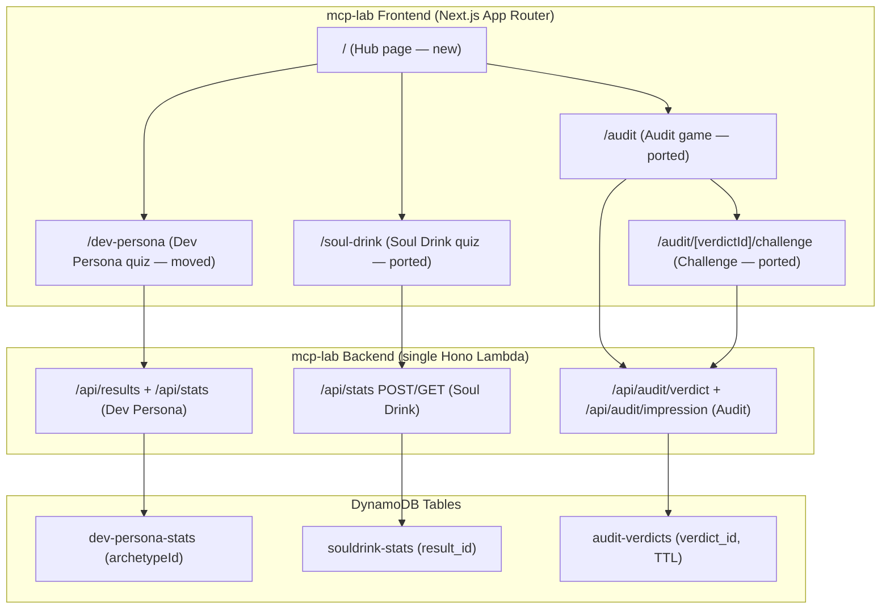
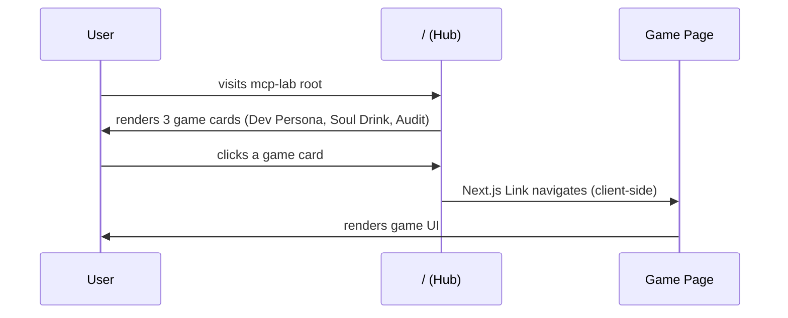
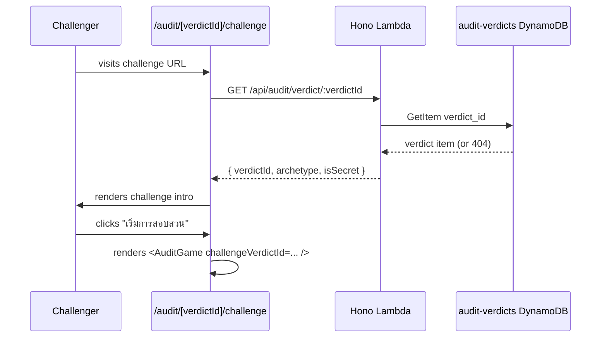

# Design Document: game-merge

## Overview

Merge the `game` project (Vite + React, two games: Soul Drink and Self-Deception Audit) into the `mcp-lab` project (Next.js 16 App Router), creating a unified three-game hub. The result is a single Next.js frontend and a single Hono/Lambda backend serving all three games (Dev Persona, Soul Drink, Audit) from the mcp-lab repository.

The migration must adapt every React Router v7 pattern (`<Routes>`, `<Link>`, `useParams`) to Next.js App Router conventions, swap every `import.meta.env.VITE_*` reference to `process.env.NEXT_PUBLIC_*`, copy public assets, merge CSS utilities, and combine the two serverless services into one `serverless.yml`.

## Architecture



## Sequence Diagrams

### Hub → Game Navigation



### Audit Challenge Flow



## Components and Interfaces

### Frontend Route Structure (Next.js App Router)

```
frontend/src/app/
├── page.tsx                          ← NEW: Hub (replaces Dev Persona hero)
├── layout.tsx                        ← KEEP: update metadata title
├── globals.css                       ← MERGE: add game CSS utilities
├── dev-persona/
│   └── page.tsx                      ← MOVE: current app/page.tsx content
├── soul-drink/
│   └── page.tsx                      ← NEW: SoulDrink client page
├── audit/
│   ├── page.tsx                      ← NEW: Audit client page
│   └── [verdictId]/
│       └── challenge/
│           └── page.tsx              ← NEW: Challenge client page
```

### New Hub Page (`/`)

**Purpose**: Landing page listing all three games as clickable cards.

**Interface**:
```typescript
// app/page.tsx
export default function HubPage(): JSX.Element

// Renders three <Link> cards navigating to:
//   /dev-persona, /soul-drink, /audit
```

**Responsibilities**:
- Replace current Dev Persona content at `/`
- Display a card for each game with name, description, and CTA
- Preserve the dark background and glassmorphism aesthetic from existing globals.css
- Use `next/link` for navigation (no `react-router-dom`)

### Dev Persona Page (`/dev-persona`)

**Purpose**: Host the existing Dev Persona quiz, moved from `/`.

**Interface**:
```typescript
// app/dev-persona/page.tsx
'use client'
export default function DevPersonaPage(): JSX.Element
// Content: current app/page.tsx unchanged, except path change
```

**Responsibilities**:
- Identical behavior to the current `/` page
- `NEXT_PUBLIC_API_URL` env var unchanged (already using `process.env.NEXT_PUBLIC_API_URL`)
- Internal API calls remain at `/api/results` and `/api/stats` (no change needed)

### Soul Drink Page (`/soul-drink`)

**Purpose**: Host the Soul Drink quiz ported from the game project.

**Interface**:
```typescript
// app/soul-drink/page.tsx
'use client'
export default function SoulDrinkPage(): JSX.Element
// Ported from: game/frontend/src/App.tsx → SoulDrinkRoot()
```

**Responsibilities**:
- Replace `import.meta.env.VITE_API_URL` with `process.env.NEXT_PUBLIC_API_URL`
- Replace `react-router-dom` `<Link>` with `next/link` `<Link>` for any back-navigation
- Use `next/image` or plain `` for mascot/banana images (from `public/`)
- Soul Drink game components (`QuestionCard`, `ResultCard`, `data/questions`) moved into `frontend/src/soul-drink/` subdirectory

### Audit Page (`/audit`)

**Purpose**: Host the Self-Deception Audit game ported from the game project.

**Interface**:
```typescript
// app/audit/page.tsx
'use client'
export default function AuditPage(): JSX.Element
// Renders: <AuditGame /> with no props (standalone play)
```

**Responsibilities**:
- AuditGame component and all audit sub-components/data/state moved to `frontend/src/audit/`
- Replace relative API calls `fetch('/api/audit/verdict', ...)` with absolute URL using `process.env.NEXT_PUBLIC_API_URL`
- Replace `react-router-dom` imports (`useParams`, `Link`) with `next/navigation` (`useRouter`, `useParams`) and `next/link`

### Challenge Page (`/audit/[verdictId]/challenge`)

**Purpose**: Host the Audit Challenge flow, where a second user takes the audit to compare verdicts.

**Interface**:
```typescript
// app/audit/[verdictId]/challenge/page.tsx
'use client'
export default function ChallengePageWrapper(): JSX.Element
// Uses: useParams() from 'next/navigation'
// Ported from: game/frontend/src/audit/pages/ChallengePage.tsx
```

**Responsibilities**:
- Replace `useParams` from `react-router-dom` with `useParams` from `next/navigation`
- Replace `<Link to="...">` with `<Link href="...">` from `next/link`
- All API calls use `process.env.NEXT_PUBLIC_API_URL`

## Data Models

### Soul Drink — API contracts (unchanged, just re-hosted)

```typescript
// POST /api/stats
interface SoulDrinkStatRequest {
  result_id: string   // e.g. "ESPRESSO", "MATCHA"
}

// GET /api/stats/:id
interface SoulDrinkStatResponse {
  result_id: string
  count: number
}
```

### Audit — API contracts (unchanged)

```typescript
// POST /api/audit/verdict
interface SaveVerdictRequest {
  verdictId: string
  archetype: ArchetypeId
  contradictionIndex: number        // [0.0, 1.0]
  archetypeScores: ArchetypeScores
}

// GET /api/audit/verdict/:verdictId
interface GetVerdictResponse {
  verdictId: string
  archetype: ArchetypeId
  isSecret: boolean
}
```

### Backend: Merged serverless.yml Resource Block

```yaml
# All three tables declared under resources.Resources:

StatsTable:          # dev-persona-stats (key: archetypeId) — existing
SoulDrinkStatsTable: # souldrink-stats   (key: result_id)  — new
AuditVerdictsTable:  # audit-verdicts    (key: verdict_id, TTL) — new
```

### Backend: Merged IAM Permissions

```yaml
# Single IAM role statements covering all three tables:
- Effect: Allow
  Action: [dynamodb:GetItem, dynamodb:PutItem, dynamodb:UpdateItem,
           dynamodb:Query, dynamodb:Scan]
  Resource:
    - Fn::GetAtt: [StatsTable, Arn]
    - Fn::GetAtt: [SoulDrinkStatsTable, Arn]
    - Fn::GetAtt: [AuditVerdictsTable, Arn]
```

## Key Porting Changes

### 1. Routing: react-router-dom → Next.js App Router

| game (React Router v7) | mcp-lab (Next.js App Router) |
|---|---|
| `<Route path="/soul-drink" element={<SoulDrinkRoot />} />` | `app/soul-drink/page.tsx` |
| `<Route path="/audit" element={<AuditGame />} />` | `app/audit/page.tsx` |
| `<Route path="/audit/:verdictId/challenge" element={<ChallengePage />} />` | `app/audit/[verdictId]/challenge/page.tsx` |
| `import { Link } from 'react-router-dom'` | `import Link from 'next/link'` |
| `<Link to="/audit">` | `<Link href="/audit">` |
| `import { useParams } from 'react-router-dom'` | `import { useParams } from 'next/navigation'` |
| `const { verdictId } = useParams<{ verdictId: string }>()` | `const { verdictId } = useParams<{ verdictId: string }>()` (same shape) |

### 2. Environment Variables

| game (Vite) | mcp-lab (Next.js) |
|---|---|
| `import.meta.env.VITE_API_URL` | `process.env.NEXT_PUBLIC_API_URL` |

AuditGame.tsx uses bare `/api/audit/verdict` (relative URL — relies on Next.js rewrites or same-origin). In mcp-lab the backend is a separate Lambda, so these calls must be prefixed with the API base URL:

```typescript
// Before (game/frontend)
const res = await fetch('/api/audit/verdict', { ... })

// After (mcp-lab/frontend)
const API_URL = process.env.NEXT_PUBLIC_API_URL ?? ''
const res = await fetch(`${API_URL}/api/audit/verdict`, { ... })
```

### 3. Public Assets

Copy from `game/frontend/public/` → `mcp-lab/frontend/public/`:
- `nanobanana_mascot.png`
- `banana_espresso.png`
- `banana_matcha.png`
- `banana_sesame.png`
- `banana_tropical.png`
- `icons.svg` (if referenced by Soul Drink components)

The `favicon.svg` from game is not copied — mcp-lab keeps its own favicon.

### 4. CSS Merging

`game/frontend/src/index.css` contains Soul Drink and Audit-specific utilities. Relevant classes to merge into `mcp-lab/frontend/src/app/globals.css`:

```css
/* From game/frontend/src/index.css — append to globals.css */

/* Fonts needed by Soul Drink (Outfit, Prompt) */
@import url('https://fonts.googleapis.com/css2?family=Outfit:wght@400;600;700;800&family=Prompt:wght@400;600;700&display=swap');

/* Audit CSS variables */
:root {
  --audit-bg: #0B0B0C;
  --audit-red: #FF4D4D;
  --audit-purple: #B388FF;
  --audit-gold: #FFD700;
}

/* Animations */
@keyframes float { ... }
@keyframes pulse-glow { ... }
.animate-float { animation: float 4s ease-in-out infinite; }
.animate-glow  { animation: pulse-glow 2s infinite; }

/* Soul Drink components */
.glass-card { ... }
.banana-btn { ... }
.apple-btn  { ... }
```

`App.css` from game contains Vite scaffold leftovers (`.hero`, `#center`, `.ticks`) — these are NOT ported. Only the Soul Drink and Audit utilities from `index.css` are merged.

### 5. Backend: Plugin and Build Tool Consolidation

mcp-lab backend uses `serverless-esbuild`. game backend uses `serverless-plugin-typescript`. The merged backend keeps `serverless-esbuild` (already in use) and drops `serverless-plugin-typescript`. The merged handler entry point stays at `src/index.ts`.

### 6. Backend: CORS Update

The merged backend must accept requests from all game origins. The ALLOWED_ORIGINS list in `mcp-lab/backend/src/index.ts` stays the same; the pattern match already allows any `.pages.dev` subdomain matching `nackxyz` or `aws-lab`, which is sufficient.

### 7. Tests Decision

The game project has three vitest test files:
- `verdictCalculator.test.ts` — pure logic, high value → **PORT to mcp-lab**
- `auditReducer.test.ts` — pure logic, high value → **PORT to mcp-lab**
- `abTest.test.ts` — simple localStorage util → **PORT to mcp-lab**

mcp-lab frontend currently has no test setup. The migration adds vitest + `@testing-library/react` + jsdom to `mcp-lab/frontend` (same config as game frontend), and the three test files are placed under `frontend/src/audit/__tests__/`.

## Error Handling

### Routing Errors

**Condition**: User navigates to `/audit/[verdictId]/challenge` with a non-existent verdictId.
**Response**: The ChallengePage fetches the verdict and receives HTTP 404 from the backend.
**Recovery**: Page displays a "ไม่พบ Verdict นี้" message with a link back to `/audit` (using `next/link`).

### API Unreachable

**Condition**: `NEXT_PUBLIC_API_URL` is empty or the Lambda is down.
**Response**: Soul Drink catches the fetch error and falls back to a mock rarity value; Audit sets `gameState: 'ERROR'` and displays an error view with a restart button.
**Recovery**: No silent failures — errors are surfaced to the user.

### Missing Environment Variable

**Condition**: `NEXT_PUBLIC_API_URL` is not set in deployment.
**Response**: Both Soul Drink and Audit API calls fall back gracefully (Soul Drink uses a random fallback rarity; Audit shows error state).
**Recovery**: Document that `NEXT_PUBLIC_API_URL` must be set in the Cloudflare Pages environment variables pointing to the merged API Gateway URL.

## Testing Strategy

### Unit Testing Approach

Port the three existing vitest test files from game to mcp-lab without modification (they test pure TypeScript functions with no React/DOM dependency). Add vitest + jsdom + `@testing-library/react` to mcp-lab frontend devDependencies with the same `vite.config.ts`-style vitest config in a `vitest.config.ts` file.

### Property-Based Testing Approach

The `verdictCalculator` contains pure, deterministic logic suitable for property-based testing. The existing example-based tests cover key cases; property tests would add value for the `contradictionIndex` invariant.

**Property Test Library**: fast-check (npm package, compatible with vitest)

### Integration Testing Approach

No automated integration tests are added as part of this migration. The correctness of the merged backend routing can be verified manually by exercising each API endpoint after deployment.

## Performance Considerations

- The merged Lambda cold-start size grows slightly (three route groups vs. one) but all routes share the same Hono app instance and AWS SDK clients — no material impact.
- The mcp-lab frontend adds Soul Drink and Audit component trees; these are lazily loaded per route via Next.js page-level code splitting, so the Hub page remains lightweight.
- Soul Drink and Audit game assets (PNG images) are served directly from Cloudflare Pages CDN under `public/` — no additional image optimization required for mascot/banana PNGs.

## Security Considerations

- The merged backend CORS policy inherits from mcp-lab: exact origin allowlist plus a `.pages.dev` pattern. The game backend's wildcard `allowedOrigins: ["*"]` is intentionally **not** carried over.
- Audit verdict IDs are generated with `crypto.randomUUID()` on the client and stored server-side. No authentication is required; IDs function as bearer tokens (unguessable UUID).
- TTL on `audit-verdicts` (30 days) is preserved in the merged serverless.yml to auto-expire old verdicts.
- The backend payload size guard (`bodyText.length > 500`) from Dev Persona is extended to all POST endpoints in the merged handler.

## Dependencies

### Frontend additions to mcp-lab

```json
// package.json — new dependencies
{
  "dependencies": {
    "html2canvas": "^1.4.1"    // already present; Soul Drink also uses it
  },
  "devDependencies": {
    "@testing-library/jest-dom": "^6.9.1",
    "@testing-library/react": "^16.3.2",
    "@vitest/coverage-v8": "^4.1.8",
    "jsdom": "^29.1.1",
    "vitest": "^4.1.8",
    "fast-check": "^3.22.0"
  }
}
```

`react-router-dom` is **not** added to mcp-lab.

### Backend additions to mcp-lab

No new npm packages needed. The Soul Drink and Audit routes use the same `hono`, `@aws-sdk/client-dynamodb`, and `@aws-sdk/lib-dynamodb` packages already present.

## Correctness Properties

*A property is a characteristic or behavior that should hold true across all valid executions of a system — essentially, a formal statement about what the system should do. Properties serve as the bridge between human-readable specifications and machine-verifiable correctness guarantees.*

### Property 1: Verdict contradiction index is bounded

*For any* valid `EvidenceLog` with 8 entries (each a valid `MainArchetypeId`), `calculateVerdict` SHALL return a `contradictionIndex` in the range [0.0, 1.0] inclusive.

**Validates: Requirements 9.1**

### Property 2: Verdict archetype scores sum to evidence count

*For any* valid `EvidenceLog` with N entries, the sum of all values in `archetypeScores` returned by `calculateVerdict` SHALL equal N.

**Validates: Requirements 9.2**

### Property 3: Walking Contradiction on score tie

*For any* `EvidenceLog` where two or more archetypes share the maximum score, `calculateVerdict` SHALL return `archetype === 'WALKING_CONTRADICTION'` and `isSecret === true`.

**Validates: Requirements 9.3**

### Property 4: Dominant archetype wins without tie

*For any* `EvidenceLog` where exactly one archetype has a strictly higher score than all others AND the `contradictionIndex` is ≤ 0.5, `calculateVerdict` SHALL return that archetype (not `WALKING_CONTRADICTION`).

**Validates: Requirements 9.4**

### Property 5: auditReducer RESTART preserves abVariant

*For any* `AuditSessionState` with any `abVariant` value, dispatching `{ type: 'RESTART' }` SHALL produce a state where `abVariant` equals the original value and all other fields match `initialAuditState`.

**Validates: Requirements 10.1**

### Property 6: auditReducer evidence log is append-only

*For any* sequence of `SUBMIT_EVIDENCE` actions, the resulting `evidenceLog` SHALL contain all previously submitted entries — no prior evidence is overwritten or removed by submitting new evidence.

**Validates: Requirements 10.2**
